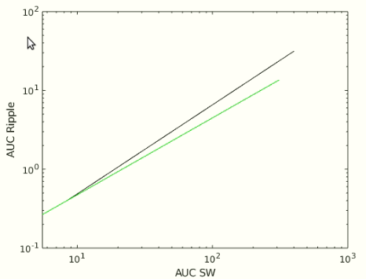

## Physics analysis

- scatter_plots.m and  scatter_plots_cbd.m : First figures created comparing Duration and AUC (No longer used).

- auc_vs_auc.m: Line plots of AUC to AUC of co-occuring events. Only includes SW and R of SWR and cSWR events.  
 

-  criticality_amplitudes.m  & criticality_plot.m : Used to generate a cumulative distribution function of the events amplitude.  (No longer used)
- scatter_plots_auc.m : Duration vs AUC (Figure including types.)

